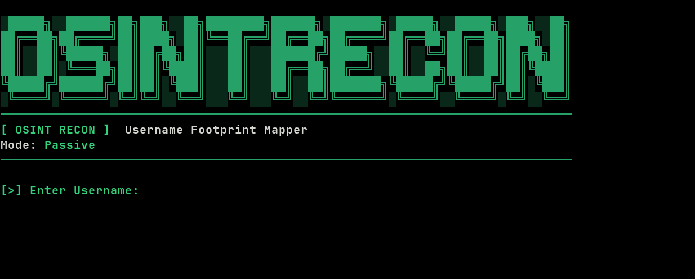

# OSINTrecon

OSINTrecon is a passive OSINT username footprint mapping tool written in Bash.  
It checks dozens of popular platforms in parallel to identify where a given username exists across the internet.

The tool is designed to be:
- Fast
- Terminal-only
- Passive (no login, no interaction)
- Lightweight and portable
- Easy to use

---

## 🔍 What is this useful for?

OSINTrecon helps with:

- OSINT investigations
- Digital footprint analysis
- Username enumeration
- Threat intelligence research
- Privacy and exposure checks
- Reconnaissance during security assessments
- Personal privacy audits (checking where your own username exists)

It only performs **passive checks** using public web pages. No accounts, no APIs, no authentication.

---

## ✨ Features

- Parallel scanning for speed
- Timeout and retry handling
- Clean and readable terminal output
- Exposure level estimation (Low / Medium / High)
- Supports dozens of popular platforms
- Pure Bash + curl

---

## 🛠 Requirements

- Bash
- curl
- grep
- coreutils (wc, cut, etc.)

Most Linux distributions already include these.

---

## 📦 Installation

```bash
git clone https://github.com/corvainx/osintrecon.git
cd osintrecon
chmod +x osintrecon.sh
bash osintrecon.sh
